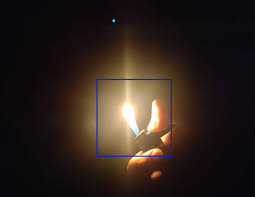

# Fire Detection



## Overview

The main aim of this project is to detect fires using image processing techniques, specifically OpenCV (cv2). We aim to demonstrate the speed and effectiveness of image processing in fire detection, which is up to 10 times faster compared to real-time sensors.

## Features

- Utilizes a pretrained model based on the Haar Cascade algorithm for fire detection (model path: `xml/fire_detection.xml`).
- Includes integration with the Blynk IoT platform to provide real-time alerts when a fire is detected. The system connects to Wi-Fi for seamless communication.
- Demonstrates a hardware comparison by integrating smoke and fire sensors with an ESP32 microcontroller. This comparison highlights the differences between traditional sensors and image processing.
- The project can be easily executed by installing the provided Conda environment using the YAML file.
- To test the system, simply place a lit matchstick in front of the camera to trigger the fire detection process.

## Getting Started

To get started with this project, follow these steps:

1. Clone this repository to your local machine.

2. Install the Conda environment using the provided YAML file:

   ```bash
   conda env create -f environment.yml
